# AZURE - DETECTOR DE IMAGENES (ANIMALES) CON CUSTOM VISION

**En esta practica aprenderas como una ia detecta imagenes (animales) con customvision de azure**

## Requisitos
- Tener una suscripcion en Azure
- Tener una conexion a internet
- Tener un navegador instalado (Brave,Google,Firefox, etc)
- Tener un banco de imagenes (puedes usar las del repositorio como ejemplo)

-------------------------

## TUTORIAL

**1.-Primero nos vamos a [Custom Vision](https://customvision.ai/) y creamos un nuevo proyecto, despues nos adentramos al proyecto creado**

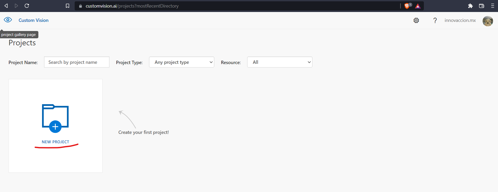

**2.-Le colocamos un nombre, la descripción, y necesitamos crear un recurso para poder hacer el analisis donde le daremos a "create new"**

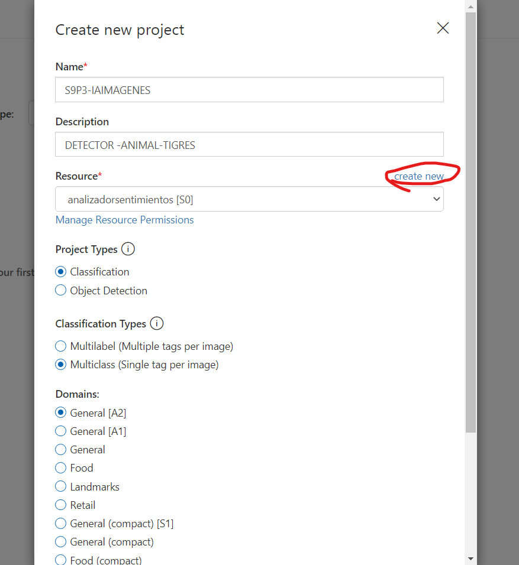

**3.-Le damos un nombre, la suscripción, el grupo de recursos,tipo,ubicación y la fijacion de precios**

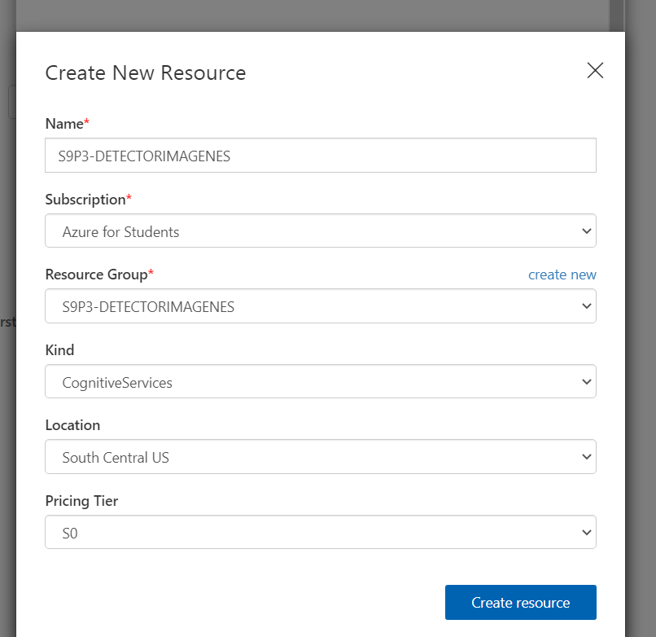

**4.-Ahora colocamos el recurso creado**

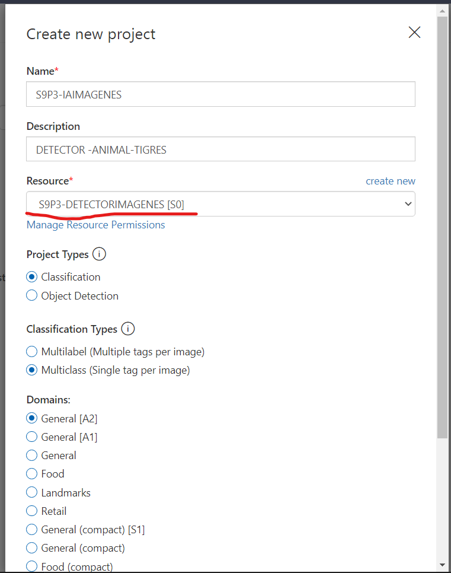

**5.-Ahora colocamos el tipo de proyecto la clasificación el dominio y le damos en create project (para esta practica se utilizaron estas caracteristicas)**

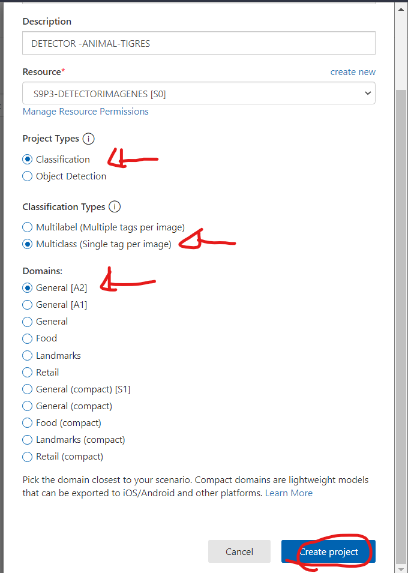

**6.-Ahora añadimos el primer lote de imagenes (en este caso sera el animal tigre)**

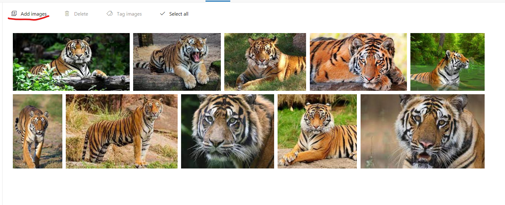

**7.-Ahora añadimos el otro lote de imagenes**

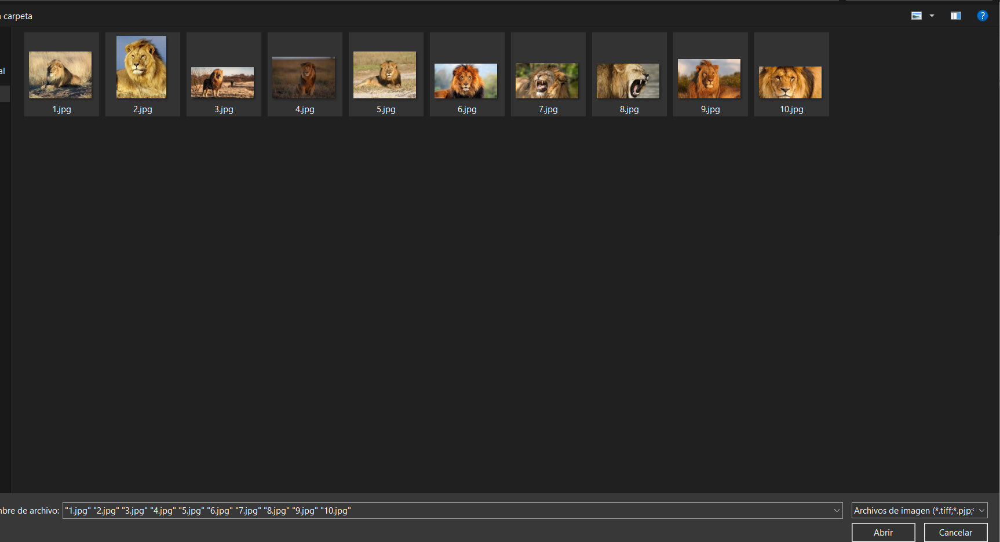

**8.-Las subimos como a continuación (le damos un nombre al lote)**

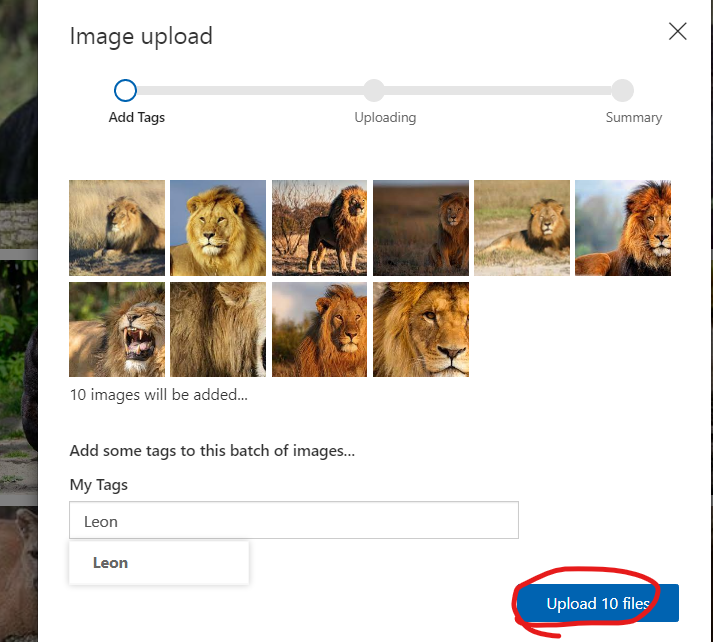

**9.-Ahora podemos subir imagenes en lote para que detecte que este no es lo que buscamos si no es otro tipo (como en el caso que haya imagenes que se parezcan las podemos poner en negativo para que detecte que realmente no son de este tipo de imagenes)**

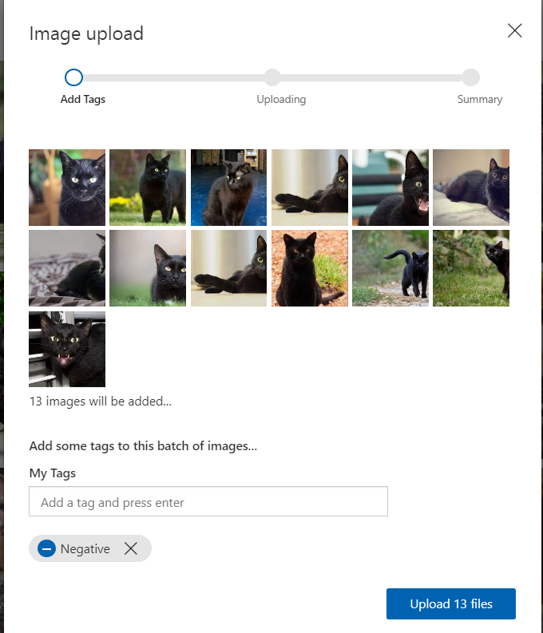

**10.-Las mandamos a entrenar (podemos aumentar la probabilidad para que sea mas efectivo pero por ende será mas caro)**

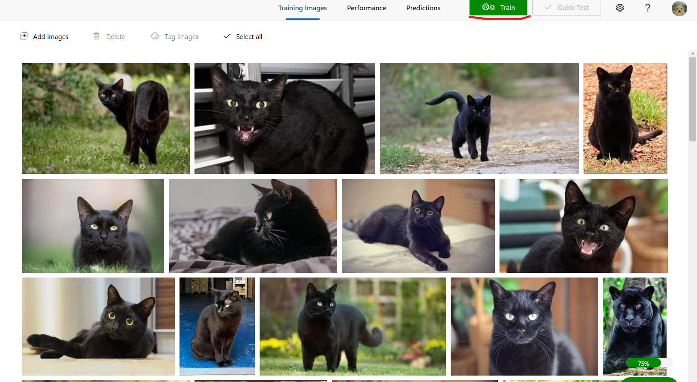

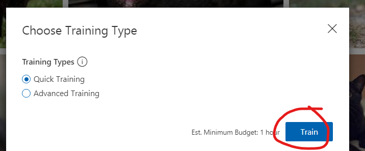

**11.-Esperamos a que termine de entrenar en nuestro modelo de ia**

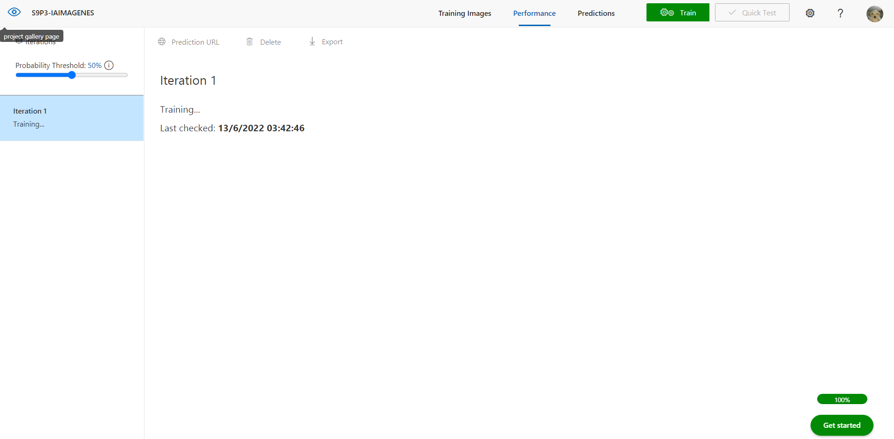

**12.-Una vez que termine, podemos ver las estadisticas de nuestro modelo (Podemos utilizar nuestro modelo dandole en quick test en la parte superior)**
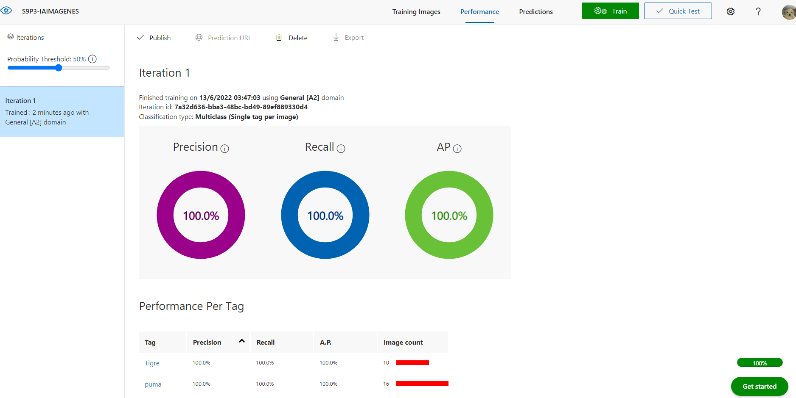

**13.-Le podemos dar la url de la imagen o buscar el archivo en nuestro local (Y como podras ver la probabilidades aparecen abajo, y que sea león es de un 89.76, quiere decir que esta aprobado, ya que si es un león)**
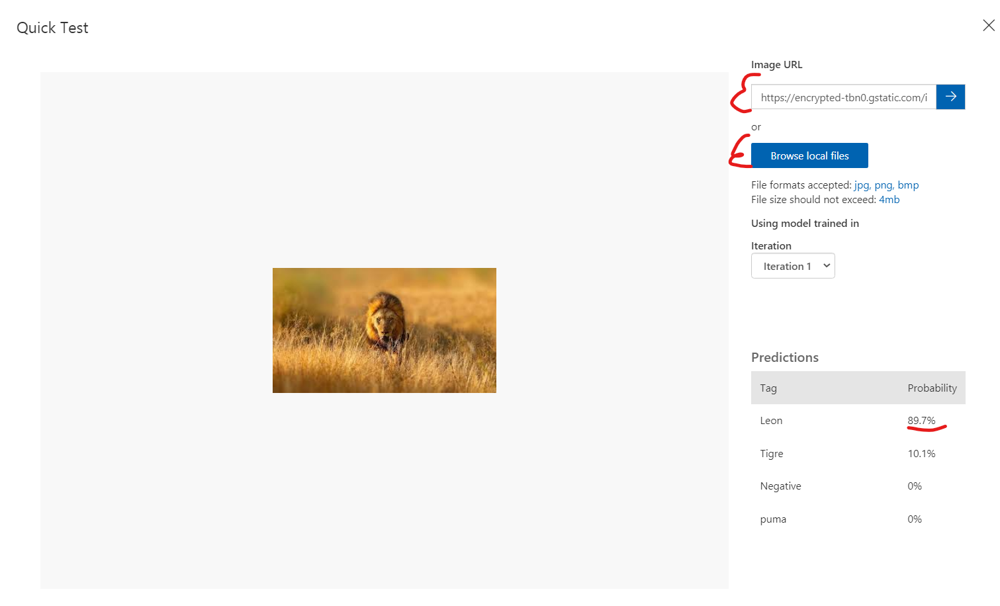

**14.-También podemos subir las imagenes y detectarlas por objetos (que detecte muchas cosas en una sola imagen), a Continuación creamos otro proyecto, le damos un nombre, una descripcion, el recurso, el tipo de clasificacion (ahora object detection) domains, y una vez hecho la connfiguración le damos en create project)**

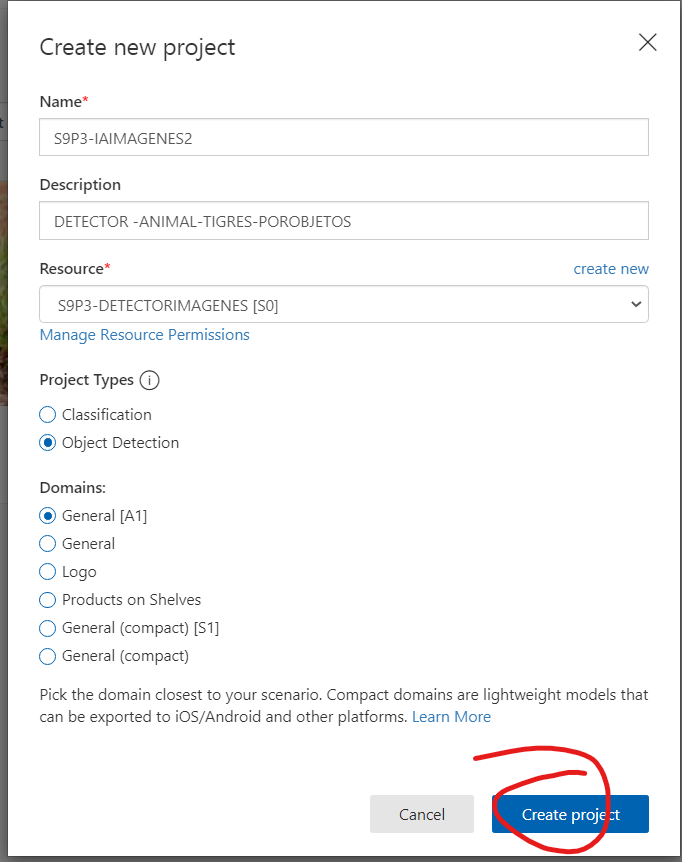

**15.-Añadimos imagen en nuestro modelo**

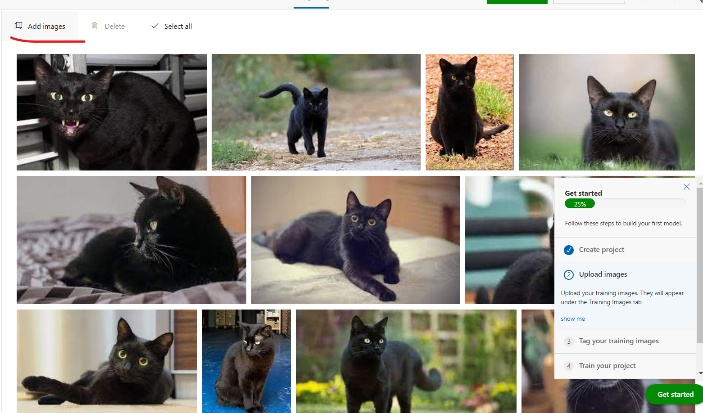

**16.-Arrastramos y seleccionamos el objeto que queramos detectar (y solamente sería el proceso de entrenarla y pasarle una imagen para que detecte como anteriormente visto en las imagenes)**

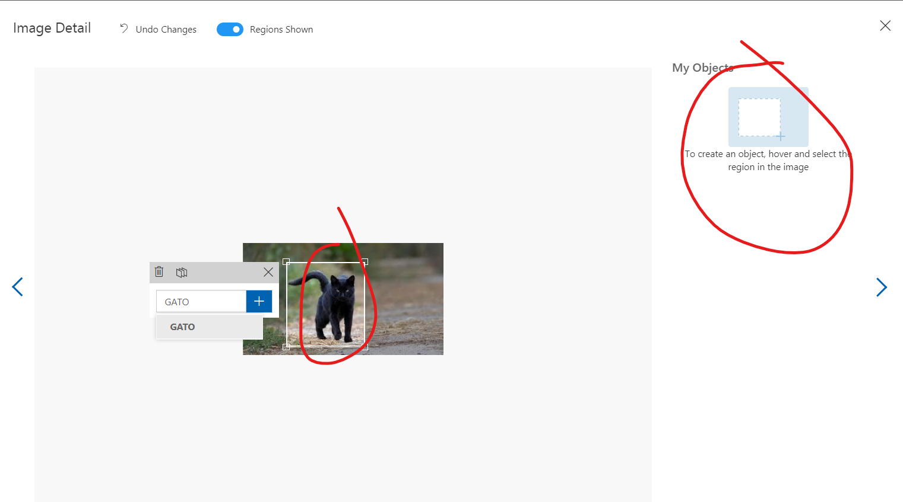
